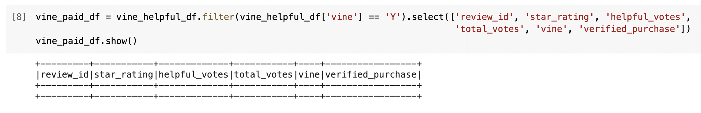
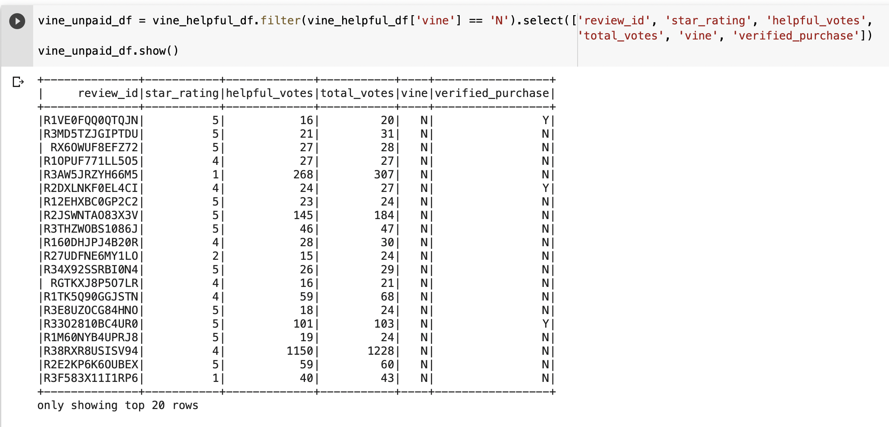
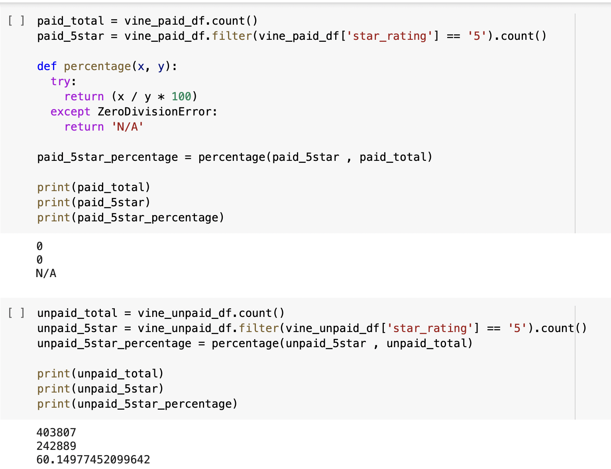

# Amazon_Vine_Analysis

# Overview of the analysis: 
The purpose of this assignment is to analyze a dataset of amazon reviews and decide whether or not the positive reviews were biased due to being part of a paid program, called Vine.

First, I created an RDS database in AWS - Amazons cloud service - which was then linked to PGAdmin on my computer.  In PGAdmin I created tables to hold the customers, products, reviews, and Vine data.

Next, in Google Colab I utilized Pyspark to extract the dataset from a collection of Amazon review datasets available online. I was able to transform the data by filtering the dataset to match the tables created in PGAdmin. The dataframes I created in Google Colab - review_id_df, products_df, customers_df, and vine_df - were loaded into PGAdmin as tables titled review_id_table, products_table, customers_table, and vine_table. 

Finally, using Pyspark, I analyzed the data to find whether or not the positive reviews were biased due to being part of the paid program.
The vine_table was filtered to show only reviews that had 20 more votes by users and further filtered to those having 50% or more ‘helpful’ votes.
From this new dataset, called vine_helpful_df, I was able to filter to create two dataframes  - one containing reviews posted as part of the Vine program and the other containing reviews unaffiliated with the Vine program. 

Lastly, for both dataframes I analyzed the total number of reviews posted, the number of 5-star reviews posted, and the percentage of 5-star reviews posted. 

# Results: 

## How many Vine reviews and non-Vine reviews were there?
- The total number of reviews posted as part of the Vine program is 0.
- The total number of reviews posted unaffiliated with the Vine program is 403807.

After creating the two dataframes to hold the reviews posted as part of the Vine program and those that are unaffiliated with the Vine program, I found that there were 0 helpful reviews posted as part of the Vine program. An image of this dataframe is seen below:

I found that many helpful reviews - 403,807 - were posted unaffiliated with the Vine program. An image of this dataframe is seen below:

## How many Vine reviews were 5 stars? How many non-Vine reviews were 5 stars?
- The number of 5-star reviews posted as part of the Vine program is 0.
- The number of 5-star reviews unaffiliated with the Vine program is 242889.

## What percentage of Vine reviews were 5 stars? What percentage of non-Vine reviews were 5 stars?
- The percentage of 5-star reviews posted as part of the Vine program is N/A.
- The percentage of 5-star reviews posted unaffiliated with the Vine program is 60.14977452099642.

The calculations used for this analysis can be seen in the image below:

